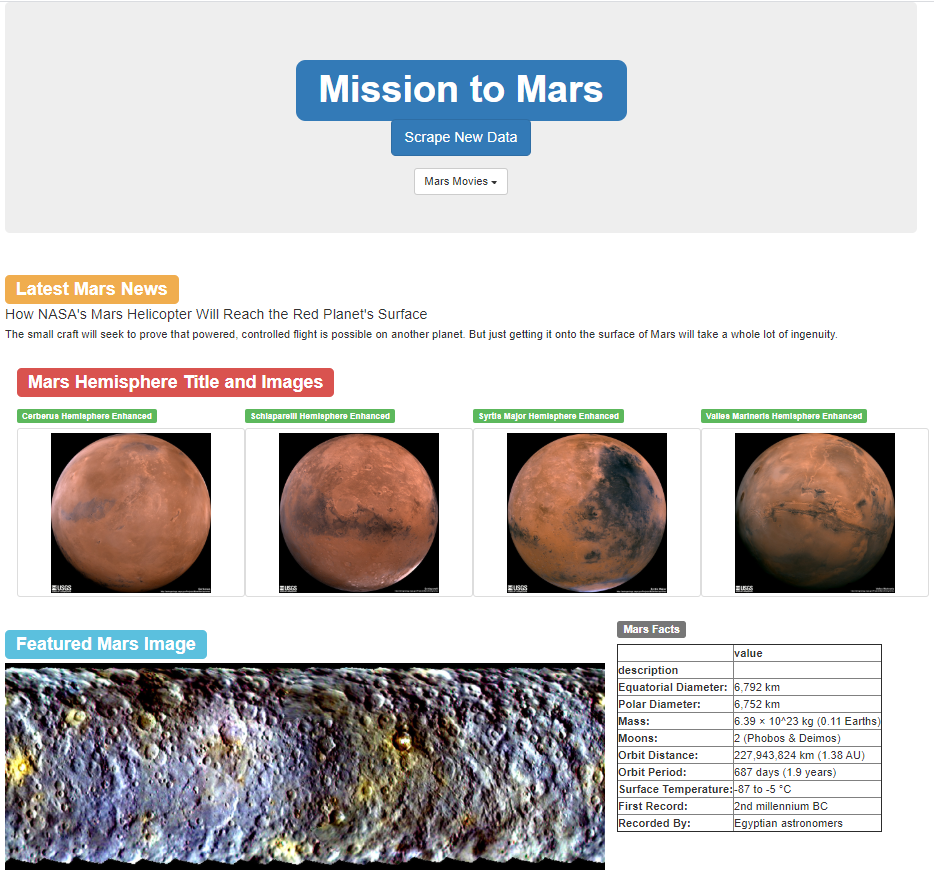
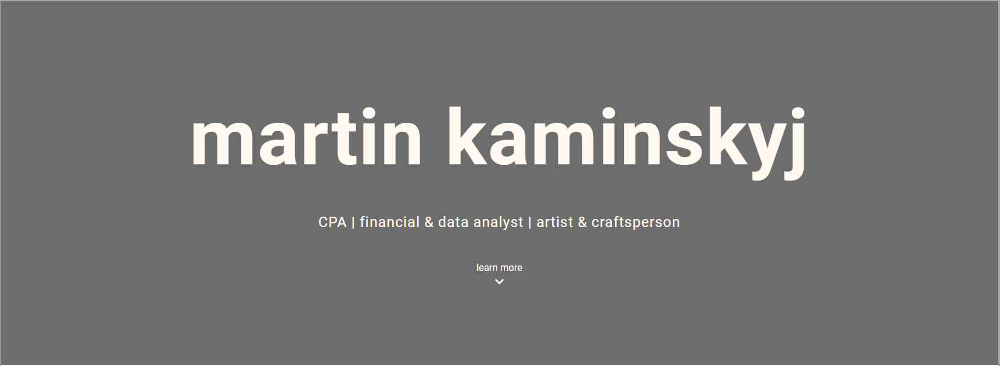
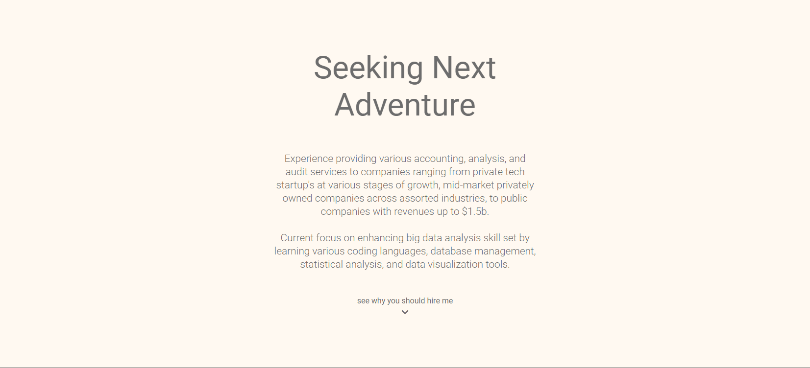
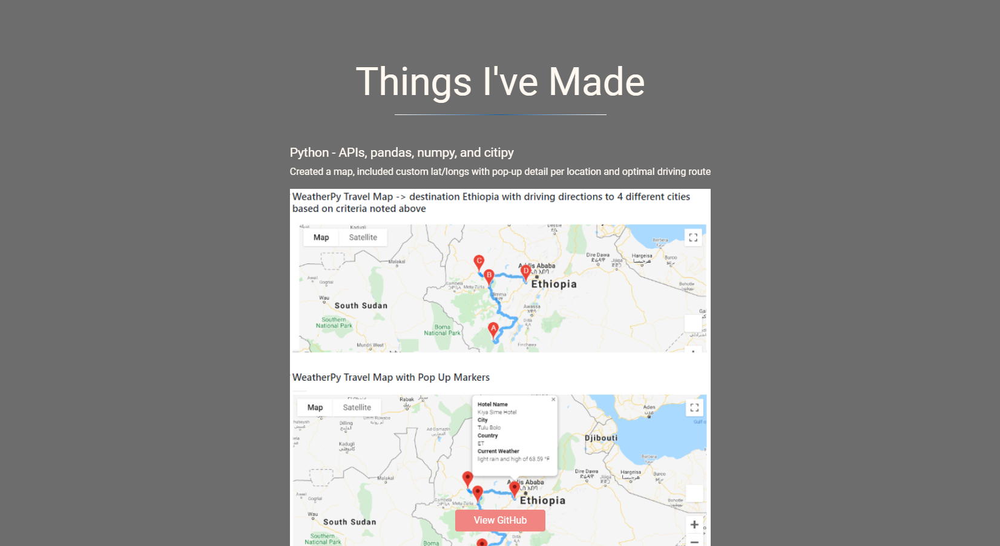
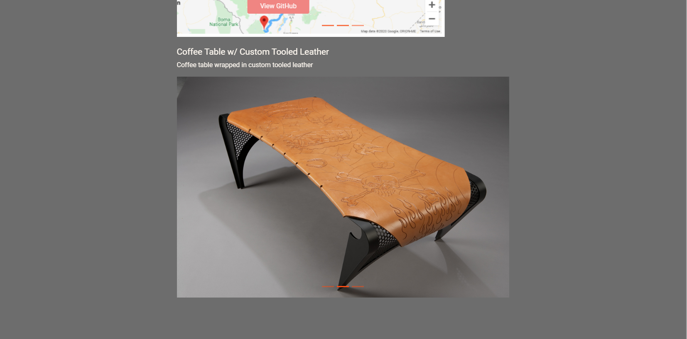
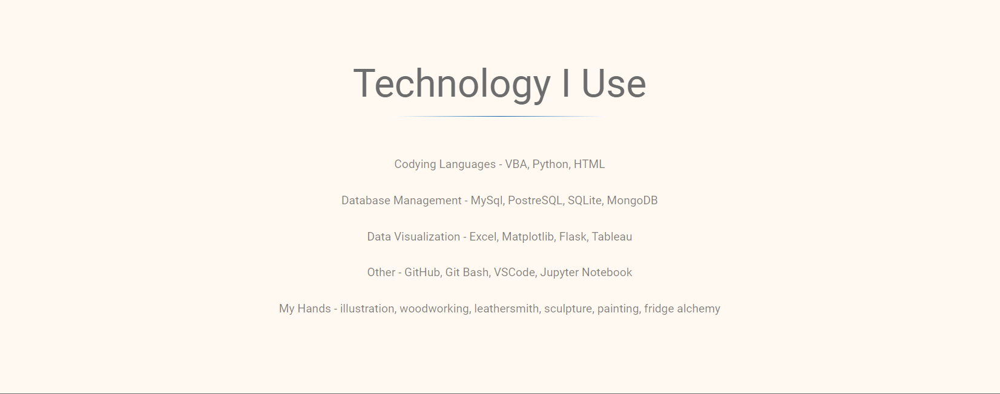
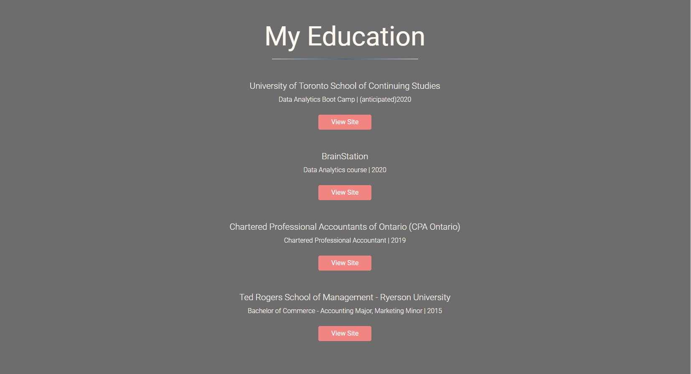
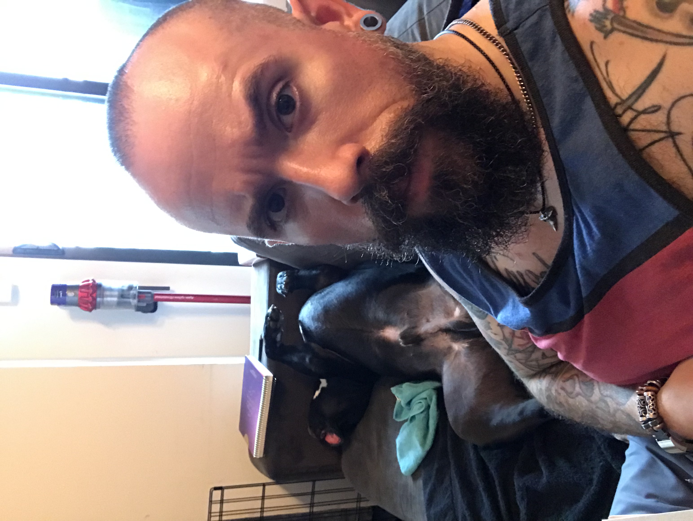

# Module 10 Challenge - Mission to Mars

Robin’s web app is looking good and functioning well, but she wanted to add more polish to it. She had been admiring images of Mars’ hemispheres and realized that the site is scraping-friendly. She would like to adjust the current web app to include all four of the hemispheres images. This requires additional scraping code to pull the high-resolution images, updating Mongo to include the new data, and altering the design of her web app to accommodate these images.

## Challenge Overview
- Use BeautifulSoup and Splinter to automate a web browser and scrape high-resolution images.
- Use a MongoDB database to store data from the web scrape.
- Update the web application and Flask to display the data from the web scrape.
- Use Bootstrap to style the web app.
- Share screenshot of completed personal portfolio

## Resources
Data Sources: [Mission to Mars](Mission_to_Mars.ipynb), [app](app_challenge.py), [scraping](scraping_challenge.py), [index](templates/index_challenge.html)

Software: Python - Browser, BeautifulSoup, pandas, datetime; Flask, MongoDB, HTML

## Challenge Summary

### Completed Website

### Screenshot of completed portfolio

*updated June 28, 2020

[link: portfolio](https://github.com/martinkaminskyj/portfolio)

## Report Completed By:

